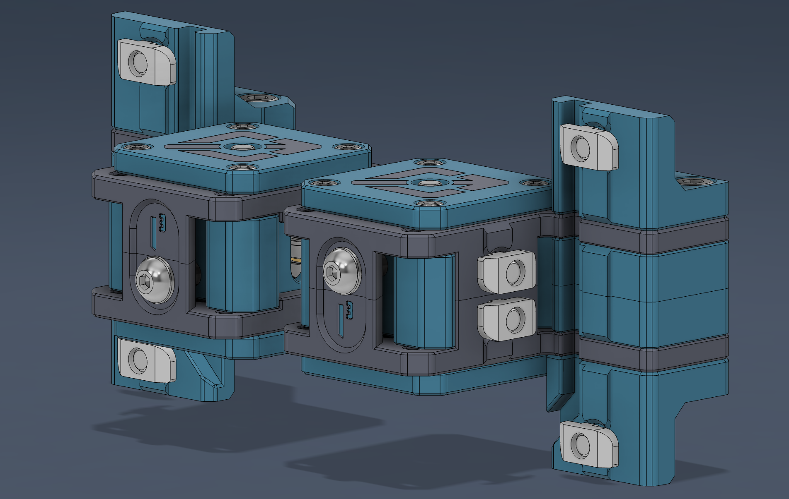
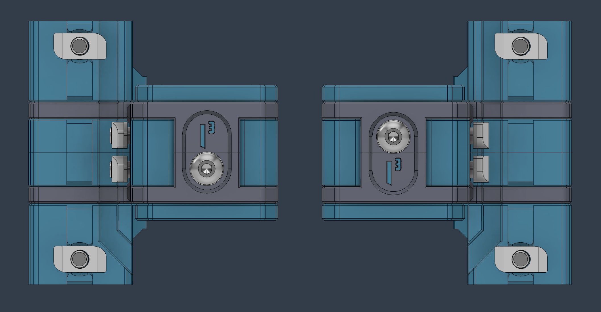
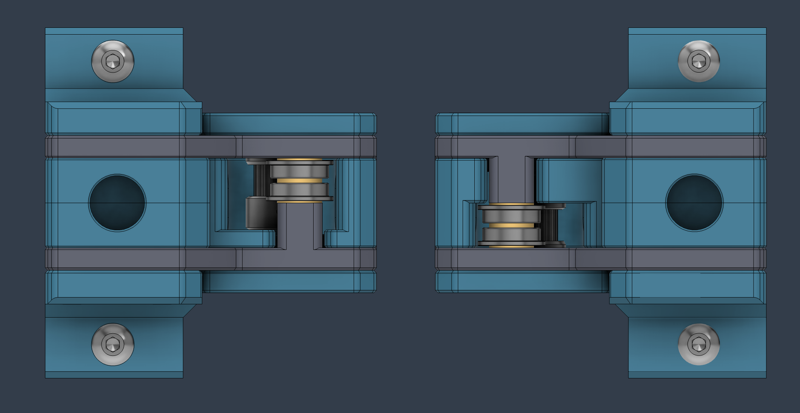

## Front Idlers - 2WD

This mod gives the opportunity to complete the build having only two steppers running X and Y while maintaining the original design to facilitate the convertion to 4WD when necessary. All needs to be done is replace the bottom plate with the stepper and voila!

### Images

  

  

  

